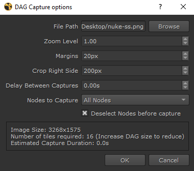

# Nuke DAG Capture

This is a python script that allows to capture a PNG image of the Nuke node graph. 
The first version was written as an answer to a [Stack Overflow Question](https://stackoverflow.com/questions/64674724/extract-a-vector-image-or-high-res-image-from-nukes-node-graph), but the code has since evolved a bit to include more options and a UI panel.

# Compatibility

The current version is compatible with Nuke 13 and above (python 3). For code compatible with older versions of Nuke, look at release 1.0.0 on GitHub.

## Usage

This script can be utilized in two methods. 

The first is a temporary approach where you can directly copy and paste the 
contents of [dag_capture.py](dag_capture.py) into the script editor and execute it entirely. 

The second method involves a more permanent 
setup. To do this, add the repository folder to the `%userprofile%/.nuke/init.py` file. If the init.py file does not exist 
in your `%userprofile%/.nuke/` directory, simply copy the one provided in `dot_nuke` folder. Then, adjust the path in the 
copied `init.py` file to correspond with the location where you cloned this repository.

Pick a path for the desired location of the screenshot (.png format) and edit the options in the UI if necessary (defaults should work okay).

Then click OK and hang on while the script does its work.

## Known issues
- I have noticed that sometimes the very first tile of the screenshot is showing black with random colored pixels. I am not sure why that is the case, and usually retrying the capture fixes the issue.
- Some node input labels move around when scrolling in the DAG, and can sometimes end up being in the screenshot multiple times, or being slightly cropped. The crop issue can be fixed by reducing the DAG preview (in lower right corner of DAG) to be invisible, and setting no right crop in the capture settings. Once the dag preview is entirely collapsed, I am not sure how to bring it back apart from restarting nuke.
